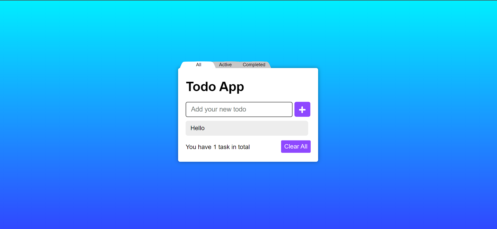

<h1>Todo App</h1>

    This is a simple JavaScript based Todo app that allows users to add, filter,
    and clear tasks. The app uses the DOM to manipulate the HTML and
    localStorage to save the tasks.

<h2>Getting Started</h2>

    To get started, simply clone or download the repository and open the
    <code>index.html</code> file in your browser. You should be able to see the
    Todo app interface.

<h2>Features</h2>
<ul>
    <li>
        Add tasks by typing into the input field and clicking the "Add" button
    </li>
    <li>
        Filter tasks by clicking the "All", "Active", or "Completed" buttons
    </li>
    <li>Clear all tasks by clicking the "Clear" button</li>
    <li>
        Tasks are saved to localStorage, so they will persist even after the
        browser is closed or refreshed
    </li>
</ul>
<h2>Code Structure</h2>

    The app uses several variables such as <code>addBtn</code>,
    <code>todoCounter</code>, <code>taskTasks</code>,
    <code>pendingFilter</code>, <code>clearAll</code>, <code>todoInput</code>,
    <code>todoList</code>, and <code>localTodo</code> to select different parts
    of the HTML and manipulate them.

    The app uses an array <code>todoSaves</code> to store the tasks and another
    array <code>filteredTodoSaves</code> to store the filtered tasks. The
    <code>filterTodoSavesFunc()</code> function is used to filter the tasks
    based on the filter mode (<code>all</code>, <code>active</code>, or
    <code>completed</code>) and the <code>updateHTML(addNewTodo)</code> function
    is used to update the DOM and refresh the list of tasks.

<h2>Steps</h2>
<table>
    <thead>
        <tr>
            <th>Steps</th>
            <th>Github</th>
            <th>JSFiddle</th>
            <th>Live Demo</th>
            <th>Showcase Video</th>
        </tr>
    </thead>
    <tbody>
        <tr>
            <td>Step 3 (base file)</td>
            <td><a href="https://github.com/Ali-Sdg90/Todo-App/tree/2471d1bfbd34de78b451684a90d3c6db4ac20350" target="_new">Link</a></td>
            <td><a href="https://jsfiddle.net/Ali_Sdg90/v60okbum/" target="_new">Link</a></td>
            <td><a href="#">---</a></td>
            <td>Coming soon...</td>
        </tr>
        <tr>
            <td>Step 4 (todo btns + SCSS)</td>
            <td><a href="https://github.com/Ali-Sdg90/Todo-App" target="_new">Link</a></td>
            <td><a href="https://jsfiddle.net/Ali_Sdg90/k4Lwxare/" target="_new">Link</a></td>
            <td><a href="#">---</a></td>
            <td>Coming soon...</td>
        </tr>
        <tr>
            <td>Step 5 (knockout.js)</td>
            <td><a href="https://github.com/Ali-Sdg90/Todo-App-KnockoutJS" target="_new">Link</a></td>
            <td><a href="https://jsfiddle.net/Ali_Sdg90/v7nac15g/4/" target="_new">Link</a></td>
            <td><a href="https://ali-sdg90.github.io/Todo-App-KnockoutJS/">Link</a></td>
            <td>Coming soon...</td>
        </tr>
        <tr>
            <td>Step 6 (localStorage)</td>
            <td><a href="https://github.com/Ali-Sdg90/Todo-App" target="_new">Link</a></td>
            <td><a href="https://jsfiddle.net/Ali_Sdg90/tz105ux4/1/" target="_new">Link</a></td>
            <td><a href="https://ali-sdg90.github.io/Todo-App/">Link</a></td>
            <td>Coming soon...</td>
        </tr>
        <tr>
            <td>Step 6 (Firebase)</td>
            <td><a href="https://github.com/Ali-Sdg90/Todo-App-Firebase" target="_new">Link</a></td>
            <td><a href="https://jsfiddle.net/Ali_Sdg90/bfLrwtxg/2/" target="_new">Link</a></td>
            <td><a href="https://ali-sdg9093-todo-app.web.app/">Link</a></td>
            <td>Coming soon...</td>
        </tr>
    </tbody>
</table>
